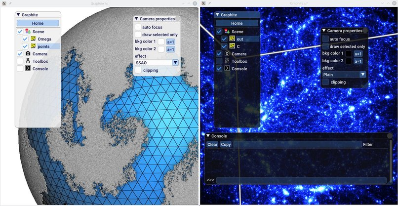

### Geogram

Geogram is a programming library of geometric algorithms. Notably, it contains
most implementations of the research algorithms developed by the
[ALICE](http://alice.loria.fr/index.php/home.html) team. 
Non-exhaustive list of features:

- Simple yet efficient Mesh data structure (for pointsets, triangulated, polygonal,
tetrahedral, hybrid (tetrahedra, hexahedra, pyramids, prisms) meshes)
- Delaunay triangulation, Voronoi diagram
- Surface reconstruction from point cloud
- Surface repair and remeshing
- Spectral analysis of surfacic meshes
- Tetrahedral mesh generation (through Hang-Si's *TetGen*)
- Mesh parametrization, generation of texture alias and normal maps
- Spatial search data structures, spatial sorting 
- Exact computer arithmetics (a-la Shewchuck, implemented in GEO::expansion)
- Predicate code generator (PCK : Predicate Construction Kit)
- Standard geometric predicates (orient/insphere)
- Less standard algorithms: more general geometric predicates, intersection
  between a Voronoi diagram and a triangular or tetrahedral mesh embedded in n
  dimensions. The latter is used by FWD/WarpDrive, the first algorithm that computes semi-discrete Optimal Transport in 3d that scales up to 1 million Dirac masses (see compute_OTM in example programs)
- Support for various file formats (.mesh, .meshb, .obj, .ply, .off, .STL, .xyz, .pts, .tet, .ovm)

Get Geogram:

- [GitHub repository](todo) (not yet available)
- [Building Geogram](install_geogram.md)
- [License](license.md)

### Graphite 

Graphite is an experimental 3D modeler, built in top of the Geogram programming
library.

- Access to all the algorithms and functionalities of the Geogram library
- Lightweight GUI based on [Dear ImGui](https://github.com/ocornut/imgui)
- Lua scripting
- Automated generation of GUI commands and Lua bindings via `gomgen`
- Plugin system
- No dependencies except Geogram (third-parties are included in the sources)
- Permissive [license](license.md) (3-clauses BSD) (TODO)

Get Graphite:

- [GitHub repository](todo) (not yet available)
- [Building Graphite](install_graphite.md)
- [Pre-compiled versions](precompiled.md) 
- [License](license.md)

### Usage

- [Gallery](gallery.md): lot of videos showing various functionalities of Graphite / Geogram
- [Examples](examples.md): list of Geogram sample programs (small executables)
- [Fequently Asked Questions](faq.md): some information about historical changes and choices

### Development and programming 

- [Design principles](design.md): principles and ideas behind the design of Geogram and Graphite.
- [Documentation](doxygen.md): documentation (generated with Doxygen) of all the classes and methods in Geogram
and Graphite.
- [FEMb (tutorial)](tutorial.md): a tutorial showing how to construct a new Graphite plugin to solve the Poisson problem with
the Finite Element Method. This is a good starting point if you want to see how the Geogram and Graphite APIs look in practice.
- [Examples](examples.md): the implementations of the Geogram sample programs are also a good way to learn how to use the Geogram library.
- [Pluggable Software Modules](psm.md): PSMs are subsets of the Geogram library than can be easily extracted and integrated into other programs.

### News

- [27/02/2018] Geogram moved to GitHub ?
- [15/02/2018] creation a new webpage for Graphite and Geogram

### Todo

- Add page for OpenNL
- Add page for devel and plugin system

